# KEDAによるKubernetesのイベントドリブンなスケーリングの実践

## KEDAとは

[KEDA(Kubernetes Event-driven Autoscaling)](https://keda.sh/)はKubernetesで動作するイベントドリブンなスケーリングを実現するためのコンポーネントです。
CPUやメモリ使用率だけでなく、外部サービスやミドルウェア、独自のAPIなどと連携することで、さまざまなイベントやメトリクスに基づいてKubernetesのワークロードをスケーリングします。

クラウドネイティブなアプリケーションでは、外部システムとのやりとりを考慮してワークロードのスケーリングを行う必要があります。
KEDAを使用してワークロードの特性に応じたイベントドリブンかつ動的なスケーリングロジックを構築することで、リソースの無駄な浪費を防ぎ、システムのパフォーマンスと可用性を向上させることができます。

本記事ではKEDA 2.14を対象として、KEDAの概要とAWS SQSとの連携によるスケーリングの実践を紹介します。

## KEDAのアーキテクチャ

KEDAはScaledObject, ScaledJobカスタムリソースに定義したスケーリングとトリガーの設定によって、ワークロードを自動的にスケーリングします。



### ScaledObject

ScaledObjectは、KubernetesのDeploymentやStatefulSet、カスタムリソース(scaleサブリソースの定義が必要)をスケーリングするための設定を定義するカスタムリソースです。

KEDAは、設定されたトリガーに基づいてScalerと呼ばれるコンポーネントを動作させ、イベントソース(例: RabbitMQやAmazon SQS)からメトリックを取得します。
そして取得したメトリックに基づいて、ワークロードのPod数を動的に調整します。

ワークロードのPod数を1以上にスケーリングする場合、Horizontal Pod Autoscaler（HPA）が使用されます。
このプロセスにおいて、KEDAはイベントのメトリックを提供し、HPAがこれをもとにPod数を調整します。

一方、ワークロードのPod数を0にする、または0から1以上に増やす際には、KEDAがワークロードのレプリカ数を直接更新します。

KEDAは内部でHPAを活用するため、同じワークロードに対してKEDAとHPAを併用することは推奨されません。

### ScaledJob

ScaledJobは、イベント駆動型のスケーリングによって動的にKubernetesのJobをスケジュールするためのカスタムリソースです。
このリソースは、実行時間が長いタスクの効率的な処理に適しています。

前述したScaledObjectは継続的なワークロード向けに使用されます。
長時間実行するタスクにおいては、terminationGracePeriodSecondsを調整してPodの終了を遅延させる必要があります。
この遅延によりPodがTerminating状態のまま残り続け、スケーリングに影響を与えることがあります。

ScaledJobを使用することで、この問題を回避し、イベントに基づいて効果的にジョブをスケジュールできます。
特にデータ処理やバッチ処理のような一時的でリソース集約型の作業において、ScaledJobはシステムのパフォーマンスを最適化し、コスト効率の向上に寄与します。

## Scaler

Scalerは、さまざまなソースからスケーリングのトリガーとなる情報を取得するコンポーネントです。
AWS、Azure、Google Cloudが提供するクラウドサービスや、RabbitMQ、Kafka、Prometheusなどのミドルウェア、独自のAPIエンドポイントやcron式によるスケジューラーなど、多様なScalerが利用可能です。
提供されているScalerの一覧は[Scalers \| KEDA](https://keda.sh/docs/2.14/scalers/)で確認できます。

ScalerはScaledObjectやScaledJobのspec.triggersに設定し、複数のScalerを組み合わせたスケーリングが可能です。
以下に、ワークロードのPod数と外部APIからのメトリックを組み合わせてスケーリングを行う設定例を示します。

```yaml
spec:
  triggers:
    - type: kubernetes-workload
      name: trigger1
      metadata:
      podSelector: "app=backend"
      value: "2"
    - type: metrics-api
      name: trigger2
      metadata:
        url: "https://12d34f2d03874d07a9fb781c02503bbc.api.mockbin.io/"
        valueLocation: "tasks"
```

さらに、[Scaling Deployments, StatefulSets & Custom Resources \| KEDA](https://keda.sh/docs/2.14/concepts/scaling-deployments/#scaling-modifiers-experimental)のドキュメントでは複数のScalerのメトリックを組み合わせて計算する実験的な機能が紹介されています。
これにより特定のスケーリング戦略をさらに細かくカスタマイズすることが可能です。

### ポーリング間隔の調整

Scalerによるイベントソースへのポーリング間隔は[spec.pollingInterval](https://keda.sh/docs/2.14/concepts/scaling-deployments/#pollinginterval)で調整できます。
デフォルトでは30秒ごとに情報を取得します。

```yaml
spec:
  pollingInterval: 30
```

### スケールインの制御

ScaledObjectでは、スケールインの際の挙動を調整することでスケーリングのフラッピングを防ぐことができます。

[spec.cooldownPeriod](https://keda.sh/docs/2.14/concepts/scaling-deployments/#cooldownperiod)はワークロードをゼロにスケールインする際の待機時間を設定します。
このパラメータは、ワークロードの活動が落ち着いた後にすぐにゼロスケールするのを防ぐために利用されます。
デフォルト値は300秒です。

```yaml
spec:
  cooldownPeriod: 300
```

Pod数が >= 1 の場合のスケーリングはHPAによって処理されます。
ScaledObjectのspec.advanced.horizontalPodAutoscalerConfig.behaviorを設定することで、HPAの挙動を細かく調整できます。
これにより、Pod数の急激な減少を避け、スケールインを段階的に行うことが可能です。
設定項目の詳細は[Horizontal Pod Autoscaling \| Configurable scaling behavior](https://kubernetes.io/docs/tasks/run-application/horizontal-pod-autoscale/#configurable-scaling-behavior)で確認できます。

```yaml
spec:
  advanced:
    horizontalPodAutoscalerConfig:
      behavior:
        scaleDown:
          stabilizationWindowSeconds: 300
          policies:
          - type: Percent
            value: 100
            periodSeconds: 15
```

### 認証

多くの場合、Scalerはイベントソースにアクセスする際に認証が必要です。
KEDAでは認証フローを管理するために[TriggerAuthentication](https://keda.sh/docs/2.14/concepts/authentication/)カスタムリソースを提供しています。

TriggerAuthenticationはScaledObjectやScaledJobとは別のリソースとして定義します。
以下はpodIdentityプロバイダを使用して、keda-operator PodのServiceAccountに関連づけられたAWS IAM Roles for Service Account(IRSA)を使用して認証する、TriggerAuthenticationの例です。

```yaml
apiVersion: keda.sh/v1alpha1
kind: TriggerAuthentication
metadata:
  namespace: myproject
  name: myapp
spec:
  podIdentity:
    provider: aws
```

TriggerAuthenticationを使用する際は、ScaledObjectまたはScaledJobのspec.triggersで、ScalerのauthenticationRefに使用するTriggerAuthenticationを指定します。

```yaml
spec:
  triggers:
    - type: aws-sqs-queue
      authenticationRef:
        name: myapp
      metadata:
        awsRegion: ap-northeast-1
        queueURL: "https://sqs.ap-northeast-1.amazonaws.com/123456789012/myapp"
        queueLength: "2"
```

TriggerAuthenticationでサポートされている認証プロバイダの一覧は[Authentication Providers \| KEDA](https://keda.sh/docs/2.14/authentication-providers/)で確認できます。

複数のNamespaceで同じ認証情報を使用する場合は[ClusterTriggerAuthentication](https://keda.sh/docs/2.14/concepts/authentication/#authentication-scopes-namespace-vs-cluster)を使用します。
ClusterTriggerAuthenticationはmetadata.namespaceを指定しないことを除き、TriggerAuthenticationと同じように定義します。

以下はTriggerAuthenticationとClusterTriggerAuthenticationの関係を示す図です。



## Amazon SQSとKEDAによるスケーリングの実践

ここからは、KEDAを使用してAmazon SQSのキューのメッセージ数に応じてDeploymentをスケールする例を紹介します。
DeploymentのPodはSQSを操作して何かしらの処理を行う、というアプリケーションを想定しています。



解説ではTerraformとHelmを使用してAmazon EKSクラスタとSQSキューを作成し、KEDAとアプリケーションをデプロイします。
それぞれのツールの使い方についての解説は省略しますので、あらかじめご了承ください。

この検証の完全なコードは以下のリポジトリで公開しています。
あわせてご参照ください。

- [hayajo/k8s-event-driven-autoscaling-with-keda/practice](https://github.com/hayajo/k8s-event-driven-autoscaling-with-keda/tree/main/practice)

### 検証環境の構築

まずはKEDAをインストールするためのEKSクラスタとSQSを作成します。

以下はEKSクラスタとSQSのTerraform定義の例です。
ノードグループを作成せず、EKS on Fargateを使用する設定となっています。
VPC IDやSubnet IDsは適宜変更してください。

```hcl
# EKS クラスタを作成します
module "eks" {
  source  = "terraform-aws-modules/eks/aws"
  version = "~> 20.0"

  cluster_name    = "keda-test"
  cluster_version = "1.29"

  vpc_id                         = "<VPC ID>"
  subnet_ids                     = [<Subnet IDs>]
  cluster_endpoint_public_access = true

  # クラスタの作成者を管理者として登録します
  enable_cluster_creator_admin_permissions = true

  cluster_addons = {
    # CoreDNSをFargateで動作させるように設定します
    coredns = {
      most_recent = true
      configuration_values = jsonencode({
        computeType = "fargate"
      })
    }
  }

  fargate_profiles = {
    default = {
      name = "default"
      selectors = [
        { namespace = "default" },
        { namespace = "kube-system" },
        { namespace = "keda" },
        { namespace = "myproject" }, # 検証アプリケーションがデプロイされるNamespaceです
      ]
    }
  }

  cluster_enabled_log_types = ["api", "audit", "authenticator", "controllerManager", "scheduler"]
}

# SQS キューを作成します
resource "aws_sqs_queue" "myapp" {
  name = ”keda-test-myapp"
}
```

### KEDAのインストール

検証環境が構築できたらEKSクラスタにKEDAをインストールするのですが、その前にKEDAで使用するkeda-operator ServiceAccountのIRSAを作成します。

以下はkeda-operator IRSAのTerraform定義の例です。

```hcl
resource "aws_iam_role" "keda_operator" {
  name = format("%s-keda-operator", module.eks.cluster_name)
  assume_role_policy = jsonencode({
    Version = "2012-10-17"
    Statement = [
      {
        Action = "sts:AssumeRoleWithWebIdentity"
        Effect = "Allow"
        Principal = {
          Federated = module.eks.oidc_provider_arn
        }
        Condition = {
          StringEquals = {
            "${module.eks.oidc_provider}:sub" = "system:serviceaccount:keda:keda-operator",
            "${module.eks.oidc_provider}:aud" = "sts.amazonaws.com",
          }
        }
      }
    ]
  })
}
```

keda-operator IRSAが作成できたら、KEDAをインストールします。
KEDAは[Helm chart](https://artifacthub.io/packages/helm/kedacore/keda)が提供されているので、これを使用してインストールします。

以下はKEDAのインストールのコマンド例です。
IRSAを有効化し、作成したkeda-operator IRSAのARNを設定します。

```shell
helm repo add kedacore https://kedacore.github.io/charts
helm repo update

helm install keda kedacore/keda \
  --set podIdentity.aws.irsa.enabled=true \
  --set podIdentity.aws.irsa.roleArn=<keda-operator IAM Role ARN> \
  --version="2.14.0" \
  --namespace="keda" \
  --create-namespace \
```

### アプリケーションのデプロイ

デプロイするmyappアプリケーションはSQSを操作するので、まずはこのPodのServiceAccount(metadata.name = myapp)のIRSAを作成してSQSを操作するためのポリシーをアタッチします。
以下はmyapp IRSAを作成するTerraform定義の例です。

```hcl
# myapp ServiceAccountのIRSAを作成します
resource "aws_iam_role" "myapp" {
  name                = format("%s-myapp", module.eks.cluster_name)
  managed_policy_arns = [aws_iam_policy.myapp.arn]
  assume_role_policy = jsonencode({
    Version = "2012-10-17"
    Statement = [
      {
        Action = "sts:AssumeRoleWithWebIdentity"
        Effect = "Allow"
        Principal = {
          Federated = module.eks.oidc_provider_arn
        }
        Condition = {
          StringEquals = {
            "${module.eks.oidc_provider}:sub" = "system:serviceaccount:myproject:myapp",
            "${module.eks.oidc_provider}:aud" = "sts.amazonaws.com",
          }
        }
      },
    ]
  })
}

# myapp IRSAがSQSを操作するためのIAMポリシーを作成します
resource "aws_iam_policy" "myapp" {
  name = format("%s-myapp", module.eks.cluster_name)
  policy = jsonencode({
    Version = "2012-10-17"
    Statement = [
      {
        Effect   = "Allow"
        Action   = ["sqs:*"]
        Resource = aws_sqs_queue.myapp.arn
      }
    ]
  })
}

# IAMポリシーをmyapp IRSAにアタッチします
resource "aws_iam_role_policy_attachment" "myapp" {
  role       = aws_iam_role.myapp.name
  policy_arn = aws_iam_policy.myapp.arn
}
```

myapp IRSAが作成できたらアプリケーションをデプロイします。
以下はServiceAccountとDeploymentのマニフェストの例です。

ServiceAccountのmetadata.annotations."eks.amazonaws.com/role-arn"には作成したmyapp IRSAのARNを設定します。
また、Deploymentのspec.template.spec.containers[0].envのQUEUE_URLにはSQSのURLを設定します。

```yaml
---
apiVersion: v1
kind: ServiceAccount
metadata:
  namespace: myproject
  name: myapp
  annotations:
    eks.amazonaws.com/role-arn: "<myapp IRSA ARN>"
---
apiVersion: apps/v1
kind: Deployment
metadata:
  namespace: myproject
  labels:
    app: myapp
  name: myapp
spec:
  selector:
    matchLabels:
      app: myapp
  replicas: 1
  template:
    metadata:
      labels:
        app: myapp
    spec:
      serviceAccountName: myapp
      containers:
        - name: myapp
          image: amazon/aws-cli
          env:
            - name: AWS_REGION
              value: ap-northeast-1
            - name: QUEUE_URL
              value: <SQS URL>
          command:
            - /bin/sh
            - -c
            - |
              continue=true
              # グレースフルシャットダウンのためのシグナルハンドラを設定します
              trap 'echo "Interrupted. Shutdown gracefully."; continue=false' TERM
              # メッセージの処理するメインループです
              while $continue; do
                # SQSからメッセージを受信します
                RECEIVE_OUTPUT=$(aws sqs receive-message --queue-url="$QUEUE_URL" --wait-time-seconds=20 --query="[Messages[0].ReceiptHandle, Messages[0].Body]" --output=text)
                RECEIPT_HANDLE=$(echo "$RECEIVE_OUTPUT" | cut -f1)
                if [ "$RECEIPT_HANDLE" = "None" ]; then
                  echo "No message received"
                  continue
                fi
                echo "Message received: $RECEIPT_HANDLE"
                # メッセージ受信中に割り込みが発生した場合は処理をスキップして終了します
                if ! $continue ; then
                  echo "Skip processing"
                  break
                fi
                # メッセージを処理します
                BODY=$(echo "$RECEIVE_OUTPUT" | cut -f2-)
                echo "Start processing message: $BODY"
                sleep 20
                echo "Finish processing message"
                # 処理したメッセージを削除します
                aws sqs delete-message --queue-url="$QUEUE_URL" --receipt-handle="$RECEIPT_HANDLE" \
                  && echo "Message deleted: $RECEIPT_HANDLE"
              done
          resources:
            limits:
              cpu: "0.25"
              memory: 256Mi
            requests:
              cpu: "0.25"
              memory: 256Mi
```

マニフェストが準備できたらEKSクラスタにデプロイしてPodが作成されることを確認します。

### TriggerAuthenticationの作成

つづいて、KEDAがSQSにアクセスして情報を取得するための認証情報を定義するTriggerAuthenticationを作成します。

この検証では[Pod Authentication Providers](https://keda.sh/docs/2.14/concepts/authentication/#pod-authentication-providers)を使用して、[AWS (IRSA) Pod Identity Webhook](https://keda.sh/docs/2.14/authentication-providers/aws/)による認証を行います。

この認証方法によるアクセスパターンは以下の3つがあります。

1つめはkeda identityOwnerパターンです。

```yaml
podIdentity:
  provider: aws
  identityOwner: keda
```

aws providerを使用したPod Authentication Providersのデフォルトのアクセスパターンで、keda-operator IRSAに対してリソースの権限を付与します。
複数のScaledObject、ScaledJobを扱う場合、keda-operatorに権限を集約する必要があります。



2つめはworkload identityOwnerパターンです。

```yaml
podIdentity:
  provider: aws
  identityOwner: workload
```

keda-operator IRSAがスケーリング対象となるワークロードのServiceAccountに関連づけられたIRSAをAssumeRoleして、対象リソースにアクセスします。
ワークロード側でリソースの権限を管理できますが、keda-operatorにワークロードのロールのすべての権限が適用される点に注意が必要です。



最後はroleArnパターンです。

```yaml
podIdentity:
  provider: aws
  roleArn: "<Role ARN>"
```

このパターンではkeda-operatorが任意のIAM RoleをAssumeRoleして対象リソースにアクセスします。
指定したIAM Roleの権限のみが適用されるため、最小権限の原則に従ってアクセス権限を設定することが可能です。
ただしこの方法では、keda-operatorやワークロードのIRSAとは別にIAM Roleを作成する必要があります。



検証ではroleArnパターンを使用してTriggerAuthenticationを作成します。

まずはSQSを操作するためのIAM Roleを作成します。
以下はTerraform定義の例です。
keda-operatorのIRSAがこのIAM RoleにAssumeRoleできるようにassume_role_policyを設定します。

```hcl
resource "aws_iam_role" "sqs_scaler" {
  name = format("%s-sqs-scaler", module.eks.cluster_name)
  assume_role_policy = jsonencode({
    Version = "2012-10-17"
    Statement = [
      {
        Action = "sts:AssumeRole"
        Effect = "Allow"
        Principal = {
          AWS = aws_iam_role.keda_operator.arn
        }
      }
    ]
  })
}

resource "aws_iam_policy" "sqs_scaler" {
  name = format("%s-sqs-scaler", module.eks.cluster_name)
  policy = jsonencode({
    Version = "2012-10-17"
    Statement = [
      {
        Effect   = "Allow"
        Action   = ["sqs:GetQueueAttributes"]
        Resource = aws_sqs_queue.myapp.arn
      },
    ]
  })
}

resource "aws_iam_role_policy_attachment" "sqs_scaler" {
  role       = aws_iam_role.sqs_scaler.name
  policy_arn = aws_iam_policy.sqs_scaler.arn
}
```

また、keda-operator IRSAがこのIAM RoleにAssumeRoleできるようにIAMポリシーをアタッチします。

```hcl
resource "aws_iam_policy" "keda_operator" {
  name = format("%s-keda-operator", module.eks.cluster_name)
  policy = jsonencode({
    Version = "2012-10-17"
    Statement = [
      # sqs-scaler IAM ロールへの sts:AssumeRole を許可します
      {
        Effect   = "Allow"
        Action   = "sts:AssumeRole"
        Resource = aws_iam_role.sqs_scaler.arn
      }
    ]
  })
}

resource "aws_iam_role_policy_attachment" "keda_operator" {
  role       = aws_iam_role.keda_operator.name
  policy_arn = aws_iam_policy.keda_operator.arn
}
```

IAM Roleの作成とIAMポリシーのアタッチが完了したら、TriggerAuthenticationを作成します。
以下はroleArnパターンを使用したTriggerAuthenticationのマニフェストの例です。
spec.podIdentity.roleArnには作成したIAM RoleのARNを設定します。

```yaml
apiVersion: keda.sh/v1alpha1
kind: TriggerAuthentication
metadata:
  namespace: myproject
  name: myapp
spec:
  podIdentity:
    provider: aws
    roleArn: "<Role ARN>"
```

マニフェストが準備できたらEKSクラスタにデプロイします。

### ScaledObjectの作成

最後にSQSのメッセージ数に応じてDeploymentをスケールするためのScaledObjectを作成します。
以下はScaledObjectのマニフェストの例です。
aws-sqs-queueのmetada.queueURLにはSQSのURLを設定します。

```yaml
apiVersion: keda.sh/v1alpha1
kind: ScaledObject
metadata:
  namespace: myproject
  name: myapp
spec:
  scaleTargetRef:
    kind: Deployment
    name: myapp
  minReplicaCount: 0
  maxReplicaCount: 3
  triggers:
    - type: aws-sqs-queue
      authenticationRef:
        name: myapp
      metadata:
        awsRegion: ap-northeast-1
        queueURL: "<SQS URL>"
        queueLength: "3" # queueLength/Pod としてスケールアウトする
```

マニフェストが準備できたらEKSクラスタにデプロイします。
デプロイしたScaledObjectがREADY = Trueになれば準備完了です。

```shell
$ kubectl get scaledobject -n myproject myapp 
NAME    SCALETARGETKIND      SCALETARGETNAME   MIN   MAX   TRIGGERS        AUTHENTICATION   READY   ACTIVE   FALLBACK   PAUSED    AGE
myapp   apps/v1.Deployment   myapp             0     3     aws-sqs-queue   myapp            True    False    False      Unknown   1d
```

### 動作確認

SQSにメッセージを送信してDeploymentがスケールアウトすることを確認します。
以下はSQSにメッセージを送信するコマンドの例です。複数回実行してメッセージDeploymentがスケールアウトすることを確認してください。

```shell
aws sqs send-message --queue-url="<SQS URL>" --message-body="$(LANG=C date)"
```

スケールアウト後のDeploymentの様子です。検証の設定では最大3Podまでスケールアウトされます。
Podが起動するとSQSからメッセージを受信して処理を開始します。

```shell
$ kubectl get deployment -n myproject
NAME    READY   UP-TO-DATE   AVAILABLE   AGE
myapp   3/3     3            3           1d
```

SQSのすべてのメッセージが正常に処理された後のDeploymentの様子です。
KEDAによるケールインが行われ、すべてのPodが削除されます。

```shell
$ kubectl get deployment -n myproject
NAME    READY   UP-TO-DATE   AVAILABLE   AGE
myapp   0/0     0            0           1d
```

なお、検証の設定ではHPAのbehavior.scaleDown.stabilizationWindowSeconds, ScaledObjectのspec.cooldownPeriodともに300秒が設定されているため、スケールインが完了するまでに少し時間がかかります。
ご注意ください。

### トラブルシューティング

スケールがうまく動作しない場合はScaledObjectをdescribeしてイベントメッセージを確認してください。

```shell
kubectl describe scaledobject -n myproject myapp
```

これにあわせて[Troubleshooting \| KEDA](https://keda.sh/docs/2.14/troubleshooting/)も参考にしてください。

## まとめ

本記事ではKEDAの概要とAWS SQSとの連携によるスケーリングの実践を紹介しました。

KEDAはイベントドリブンなスケーリングを実現するための強力なツールであり、外部サービスやミドルウェアとの連携によって柔軟なスケーリングを実現できます。
内部的にはHPAを活用してスケーリングを行うため、HPAを置き換える形でKEDAを使用することが可能です。

imKubernetesのワークロードにおける効率的なスケーリングを実現するために、KEDAを活用してみてはいかがでしょうか。
